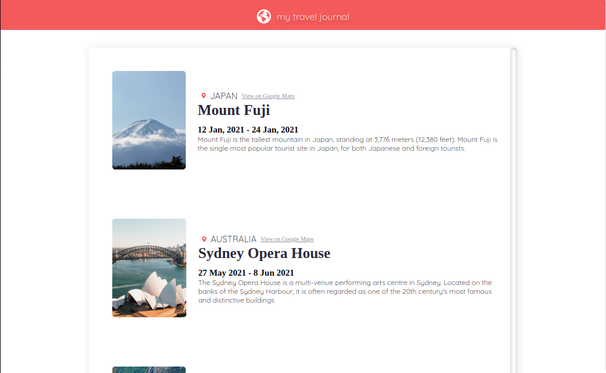

# TRAVEL JOURNAL 

- his is a simple example of a travel journal created in react 
- It is a practice on how to use props to pass data into a component. 
--- 
## UI

--- 
* The starting template has been made using [vite](https://vitejs.dev/)
* I considered this because it is not as   heavy as compared to create react app. 
* I'd recommend using this template in smaller projects. 